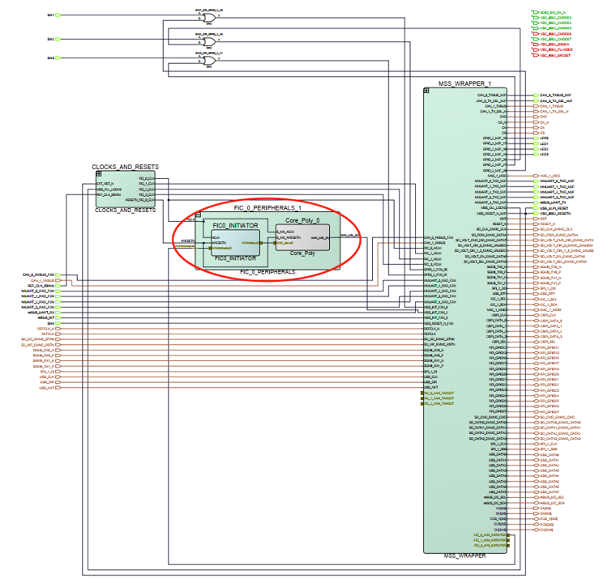

# Hardware Projects

The hardware projects are under documents [Kyber/Kyber_HW](./Kyber/Kyber_HW/) and [Dilithium/Dilithium_HW](./Dilithium/Dilithium_HW/), which are generated by Libero SoC v2022.2. The projects are derived from the official reference Libero design, which can be found here:

<https://github.com/polarfire-soc/icicle-kit-reference-design>.

## Design Description

The diagram below shows the top level design for both Kyber and Dilithium.

The **MSS_WRAPPER** contains the 64-bit 5x core RISC-V Microprocessor Sub-System (MSS). The accelerator implemented using FPGA is marked with a red circle. PolarFire SoC FPGA provides multiple Fabric Interface Controllers (FIC) to enable connectivity between user logic in the FPGA fabric and MSS. We place our accelerator on the **FIC0** interface.

In the **FIC0_0_PERIPHERALS** module, the **FIC0_INITIATOR** configues the address range of the accelerator, which is from 0x60010000 to 0x6001ffff. The **Core_Poly** is the accelerator that implements polynomial arithmetic operations of Kyber or Dilithium. The Verilog code is under document `hdl`. The conflict-free memory mapping scheme for NTT calculation refers to the work of [cfntt_ref](https://github.com/xiang-rc/cfntt_ref).

## How to Use

To use the hardware projects:

- Clone or download one of the hardware projects
- Open Libero SoC
- Open `Project->Open Project`, select `MPFS_ICICLE.prjx`
- Connect Icicle kit J33 to the host PC, configure the jumpers as [MPFS Icicle Kit User Guide](https://github.com/polarfire-soc/polarfire-soc-documentation/blob/master/reference-designs-fpga-and-development-kits/icicle-kit-user-guide.md)
- Double click "Run Program Action" to program the device

Next, the corresponding software projects with hardware acceleration can be run on the board.
