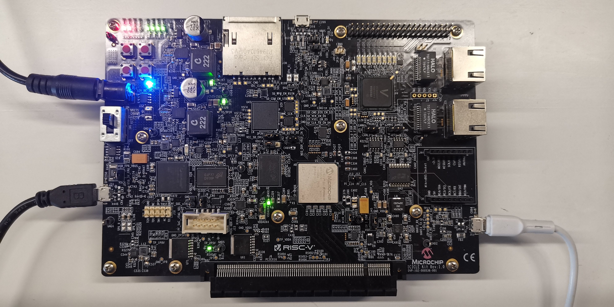

# Optimized Hardware-Software Co-Design for Kyber and Dilithium on RISC-V SoC FPGA

This repository provides implementations of Kyber and Dilithium based on Multi-Core RISC-V SoC FPGA platform. Each algorithm is implemented in three different ways:

- Baseline software implementation on a single core.
- Hardware-software co-design implementation on a single core.
- Hardware-software co-design implementation on multiple cores.

## Pre-Requisites

Here are the devices and tools we use for evaluating our implementations:

- Host PC with Windows 10 operating system.
- Microchip [PolarFire SoC FPGA Icicle Kit](https://www.microsemi.com/existing-parts/parts/152514), which features the MPFS250T-FCVG484EES device.
- Microchip [Libero SoC](https://www.microchip.com/en-us/products/fpgas-and-plds/fpga-and-soc-design-tools/soc-fpga/softconsole#downloads) v2022.2 for SoC design and hardware code (Verilog) implementation.
- Microchip [SoftConsole](https://www.microchip.com/en-us/products/fpgas-and-plds/fpga-and-soc-design-tools/soc-fpga/softconsole#downloads) v2022.2 for software implementation and system verification.
- Tera Term for serial communication.

## Code Organization

- Implementation projects for Kyber and Dilithium are under documents [Kyber](./Kyber/) and [Dilithium](./Dilithium/), respectively.
- `XX/XX_HW/` contains the SoC design and hardware code for XX (Kyber or Dilithium). This project can be opened by Libero SoC.
- `XX/XX_SW_baseline/` contains the baseline software implementation of XX (Kyber or Dilithium) on a single RISC-V core. This project can be opened by SoftConsole.
- `XX/XX_SW_acceleration/` contains the hardware-software co-design implementation of XX (Kyber or Dilithium) on a single RISC-V core. This project can be opened by SoftConsole.
- `XX/XX_SW_multicore/` contains the hardware-software co-design implementation of XX (Kyber or Dilithium) on multiple RISC-V cores. This project can be opened by SoftConsole.

## On-Board Test

We use the PolarFire SoC FPGA Icicle Kit as the target platform, which can be seen as below.

For further details on how to conduct tests on this board, please refer to [Hardware.md](./Hardware.md) and [Software.md](./Software.md).
