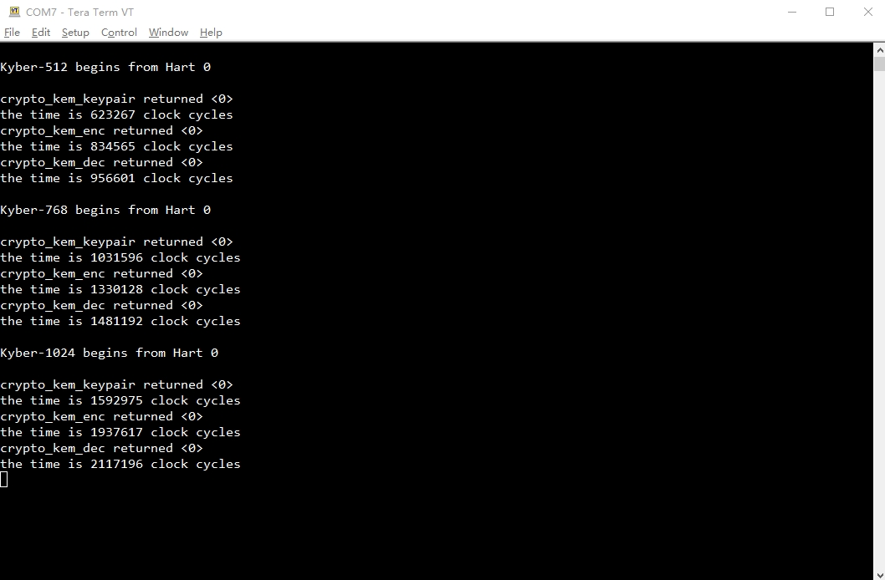

# Software Projects

For each algorithm, the software projects involve three versions of implementations. They are all generated by SoftConsole v2022.2 and derived from the official bare mental examples, which can be found here:

<https://github.com/polarfire-soc/polarfire-soc-bare-metal-examples>

## Design Description

- The MSS configuration information is in `src/boards/icicle-kit-es/fpga_design/fpga_design_description/ICICLE_MSS_mss_cfg.xml`, which is generated by [PolarFire SoC MSS Configurator](https://www.microchip.com/en-us/products/fpgas-and-plds/fpga-and-soc-design-tools/soc-fpga/polarfire-soc-mss-configurator).
- For the baseline implementation, the application code is under `src/application/hart1`. It is fetched from [NIST official website for PQC](https://csrc.nist.gov/Projects/post-quantum-cryptography/selected-algorithms-2022) and can be run on a single U54 processor.
- For the hardware-software co-design implementation on a single core, the application code is under `src/application/hart1` and the FPGA driver code is under `src/platform/drivers/fpga_ip/CorePoly`. It can be run on a single U54 processor after the corresponding accelerator is programed.
- For the hardware-software co-design implementation on multiple cores, the application code is under `src/application/hart(1-4)` and the FPGA driver code is under `src/platform/drivers/fpga_ip/CorePoly`. It can be run on multiple U54 processors after the corresponding accelerator is programed.

## How to Use

To use the software projects:

- Clone or download one of the software projects into a workspace directory from the softconsole version you are using.
- Open the project in SoftConsole.
- Right click the project and select `Properties`. Then select `C/C++ Build->Settings->Configuration` as `LIM-scratchpad-Debug` and set it as Active.
- Build the project.
- On connecting Icicle kit J11 to the host PC, you should see four COM port interfaces connected. To use this project the host PC must connect to the COM port interface0 using a terminal emulator such as Tera Term configured as: 115200 baud, 8 data bits, 1 stop bit, no parity, no flow control.
- Right click the project and select `Run As->Run Configurations...->Run` to execute the software project on board.

## Test Results

Test results for the baseline implementation of Kyber on a single core:

Test results for the hardware-software co-design implementation of Kyber on a single core:

Test results for the hardware-software co-design implementation of Kyber on multiple cores:

Test results for the baseline implementation of Dilithium on a single core:

Test results for the hardware-software co-design implementation of Dilithium on a single core:

Test results for the hardware-software co-design implementation of Dilithium on multiple cores:

